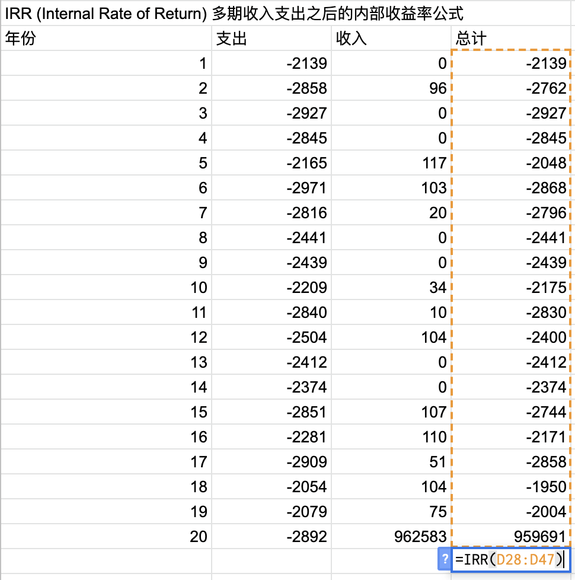
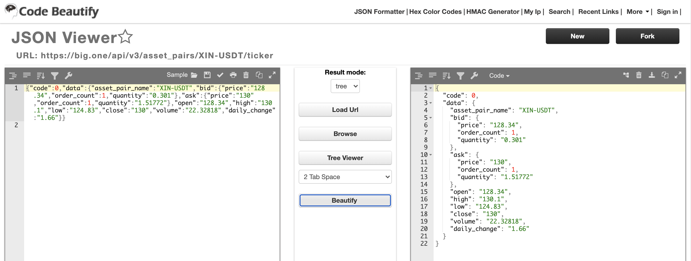

# 电子表格简明进阶教程

电子表格几乎可以称作是计算机时代里「最伟大的发明之一」—— 因为它使得绝大多数普通人瞬间拥有了与数学家一样的「算力」。

举个例子，$2^2 = 4$ 或者 $3^3 = 27$ 上过小学的人都能算出来（其实是背出来的），可是，$2.5^{3.2} = ?$ 我们的大脑直接宕机了 —— 别说我们普通人了，数学家的脑子也一样会宕机…… 用电子表格就简单了，无非是 `=power(2.5, 3.2)`，等于 `18.76756928`。在没有电子表格之前，我们就是束手无策啊！

事实上，在斐波那契于 1202 年发表《计算之书》之前，欧洲人还在使用罗马数字，你可以想象一下，没有小数点的时代里，人们计算利息或者汇率有多麻烦甚至不可能？在阿拉伯数字成为人类计算的通用工具之后，要再过将近五百年，才有幂运算的出现；直到 19 世纪上半叶，法国数学家拉克洛瓦（S. F. Lacroix）在他出版的《代数学》讨论了同底数幂的乘法法则之后，指数律才开始出现于任何一本代数教科书中…… 今天，人们在初中的时候就已经学习幂运算了 —— 不过，实际上，大多数人在生活中很少真的去用，虽然其实它总是最必须的计算工具之一。

## 说明

Github 的 markdown 不支持 LaTeX 数学公式，所以，在 GitHub 上大家会看到诸如 `$2^2 = 4$` 这样的 inline LaTeX。如果你使用类似 [Typora](https://typora.io/) 这样的 Markdown 编辑器打开的话就可以看到正确的数学表达式。当然，在 Typora 中也需要设置，勾选`Inline Math (e.g: $\LaTeX$)`：


另外，也可以直接查看 [README.pdf](README.pdf) 查看正确显示的内容。

> 注：当前这个教程中使用的是 [Google Spreadsheets](https://docs.google.com/spreadsheets/)，MAC 上的 Numbers 引入外部数据很受局限，而 Windows 上 Microsoft Office 套件中的 Excel 虽然也有[一整套的外部数据导入方式](https://support.microsoft.com/en-us/office/import-data-from-external-data-sources-power-query-be4330b3-5356-486c-a168-b68e9e616f5a)，但相对更加麻烦（还得学它那个比较令人讨厌的 VBA）……

## 1. 简单幂运算

做投资的人最需要幂运算 —— 当然，也是因为加减乘除反正谁都会。

如果一个投资标的可以做到年化复合回报率 15%，那么，一百年后，它为投资人创造了多少倍的回报呢？—— 还别说，真有这样的投资标的，2019 年的时候，可口可乐公司上市一百周年。人们算了一下，在这一百年间，可口可乐公司竟然为股东创造了 15% 的年化复合回报率！

> $(1 + 15\%)^{100} = ?$

在电子表格里的某个单元输入以下公式：`=power((1+15%), 100)`，而后就会得到结果：`1174313.451` —— $117.4313$ 万倍！在一百年的时间里，可口可乐公司为股东创造了 117 万多倍的投资回报！

反过来，若是你想知道能给你在10 年里创造 20 倍的投资标的应该做到多少的年化复合回报率呢？

如果我们想做到 $n$ 年 $m$ 倍的投资回报，那么年化复合回报率 $x$ 应该是多少呢？

> $\because (1 + x)^n = m$
>
> $\therefore x = \sqrt[n]{m} - 1 $

写到电子表格里就是 `x = POWER(m, 1/n) - 1`

10 年里创造 20 倍的投资标的应该做到多少的年化复合回报率呢？我们只需要在电子表格的某个单元输入以下公式：`=power(20, 1/10) - 1` ，会得到 `0.3492828477`，也就是说，得做得到年化复合回报率 $35\%$ 左右的投资标的才能让你赚到 10 年 20 倍…… 10 年 10 倍呢？大约需要做到 $26\%$（即，`0.2589254118`）。

总结一下：

> * `POWER(x,y)` 就相当于是 $x^y$；
> *  `POWER(x, 1/y)` 就相当于是$\sqrt[y]{x}$

## 2. 定投收益率计算

某一个特定的起始金额用 `POWER(x,y)` 就足够了，可若是计算定投，就不够了…… 因为金额可能随时增加。这样的时候，就得用其它公式了，比如

> `FV(rate, nper, pmt, pv, type)` 

FV 是 Future Value 的缩写。它适合用于基于固定利率和等额分期付款方式，返回某项投资的未来值。

`FV` 函数有 5 个参数，分别如下：

> * rate，贴现率、利率、或收益率
> * nper，期数，年、月、日都可以（如果以月为期，那么，rate 应该是月息）；
> * pmt，投入金额，也就是每期流入的现金
> * pv，现值，也就是初期投入的现金
> * type，计算期初值，此处设置为 1；计算期末值，此处设置为 0


**注意**：

> 在电子表格的财务公式中，支出用**负数**，收入用**正数**。

当我们想知道如果我要 $n$ 期后得到资金 $m$，那么每个月要投入多少钱 $x$？每月需要投入多少钱，那么，要用 PMT 函数（PMT 是 PayMenT 的缩写）：

> `PMT(rate, nper, pv, fv, type)`


## 3. 定期不定额的收益率计算

电子表格里还有个很厉害的财务函数，用来计算不定期、不定金额、可以包含收支的收益率计算公式，`IRR（Internal Rate of Return）`和` XIRR`。

假设在 20 年时间里，你一直每年购买某支股票，每年购买两三千元之间，有些年份里会收到一些股息 —— 这相当于是「定期不定额」—— 到了第 20 年，你手中的股票价值为 962,583，那么，这些年来你的投资复合年化回报率是多少呢？`IRR` 公式很简单，就是把这些年的现金流罗列出来后，用 `=IRR(xx:yy)` 算出来：



电子表格计算的结果是，25.78%。

## 4. 不定期不定额的收益率计算

一般来说，人们在投资的时候，很难非常准时地以一年或者一月买入或者卖出，相当于「不定期不定额」—— 那么就可以用 XIRR 公式去计算总收益率。`XIRR`公式很简单，就是 `=XIRR(现金流,日期流)`


如此一通操作之后，总收益率是 $77.98\%$。

## 5. 引入外部数据

有时我们希望电子表格中的某个数据可以实时引用网络上的外部数据。比如，你可能想要在[BigONE](https://big.one) 这个交易所上正在交易的 XIN 的实时价格……

### 5.1 ImportXML

Google Spreadsheets 里内建了一个 `ImportXML()` 函数，它可以让你获取任意网页里的任意数据。

比如，如果我们想要获取 Coinmarketcap 上的比特币实时价格数据，那么，我们用浏览器打开 https://coinmarketcap.com/currencies/bitcoin/markets/ 就可以看到。如果我们用鼠标右键点击价格数据之后，选择 `Inspect` 的话，看到的是这样的：


`ImportXML()` 使用 XPath 语法获取数据，现在我们要获取的是这个网页里，`class` 为 `priceValue___11gHJ` 的 `div` 区块里的数据…… 那 `ImportXML()` 要写的内容也没多复杂：

> `=IMPORTXML("https://coinmarketcap.com/currencies/bitcoin/markets/", "//div[contains(@class, 'priceValue___11gHJ')]")`

如此这般，我们获得的是一个字符串，如上图网页中所显示的那样，是 `$29,228.84` 。可我们想要的是可用来计算的价格数值，而非一个字符串 —— 那怎么办？再套上一个 `value()` 函数就可以了：

> `=value(IMPORTXML("https://coinmarketcap.com/currencies/bitcoin/markets/", "//div[contains(@class, 'priceValue___11gHJ')]"))`

另外，想要深入学习 XPath 的话，可以参照 [w3schools 上的 XPath 教程](https://www.w3schools.com/xml/xpath_intro.asp)。

### 5.2 ImportJSON

网络上，很多动态数据网站都提供 API，它们一般使用 *json* 数据格式。比如，[BigONE](https://big.one) 就是是有 API 的：

> https://open.big.one/docs/api.html

[通过翻阅文档](https://open.big.one/docs/spot_asset_pair_trade.html)，大致可知 XIN-USDT 的 json 数据链接如下：

> https://big.one/api/v3/asset_pairs/XIN-USDT/ticker

这个链接返回的是一个 *json* 数据包：

```json
{"code":0,"data":{"asset_pair_name":"XIN-USDT","bid":{"price":"128.34","order_count":1,"quantity":"0.301"},"ask":{"price":"130","order_count":1,"quantity":"1.51772"},"open":"128.34","high":"130.1","low":"124.83","close":"130","volume":"22.32818","daily_change":"1.66"}}
```

有太多大括号嵌套，乃至于这样根本看不清楚嵌套关系…… 幸亏网上有很多工具，比如，[Code Beautify](https://codebeautify.org/jsonviewer)…… 用它处理一下好了。



—— 哦！原来可以调取 `/data/close` 里的数据就可以了……

对于 json 数据，有个外部公式，叫做 `ImportJSON`，在电子表格的单元格里，它是这么写的：

> `=ImportJSON("https://big.one/api/v3/asset_pairs/XIN-USDT/ticker", "/data/close","noHeaders")`

不过，现在还不能显示正确，因为 ImportJSON 是个外部工具（[你可以在 Github 上查看它的仓库](https://github.com/bradjasper/ImportJSON)），所以你需要做些额外的设置：

> 1. 点击 `Tools` 菜单，选择 `Script Editor`；
> 2. 点击 `Create script for Spreadsheet`；
> 3. 删除掉编辑器里的代码，替换成[这个脚本的代码](https://raw.githubusercontent.com/bradjasper/ImportJSON/master/ImportJSON.gs)；
> 4. 将脚本名称更换为 `ImportJSON.gs`，并点击保存按钮；
> 5. 再返回电子表格之后，即可在任意单元格里使用 `ImportJSON()` 函数了……

当然，为了计算时不出意外，导入的数据，还是要用 `value()` 转换一下：

> `=value(ImportJSON("https://big.one/api/v3/asset_pairs/XIN-USDT/ticker", "/data/close","noHeaders"))`

## 6. 示例表格

以上教程中的所有公式和数据，都可以在保存于 Google Spreadsheets 上的《[电子表格简明进阶教程示例表格](https://docs.google.com/spreadsheets/d/1WLWukDdHPMt3Zx19bROMAJkM8PVS46TKiYFwyk7vC1Y/edit?usp=sharing)》内看到。

